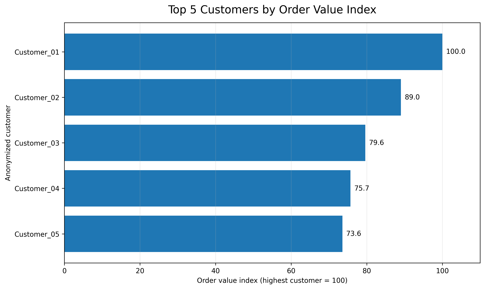
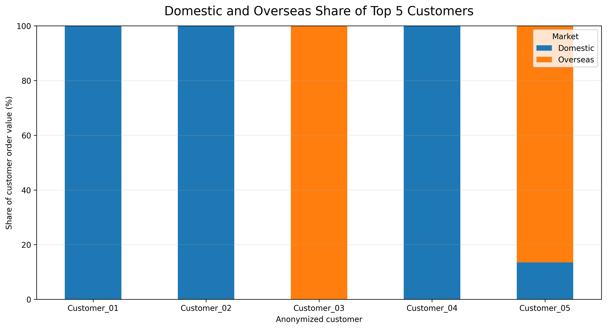
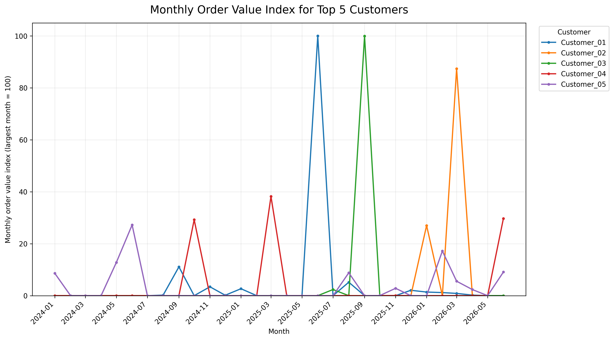
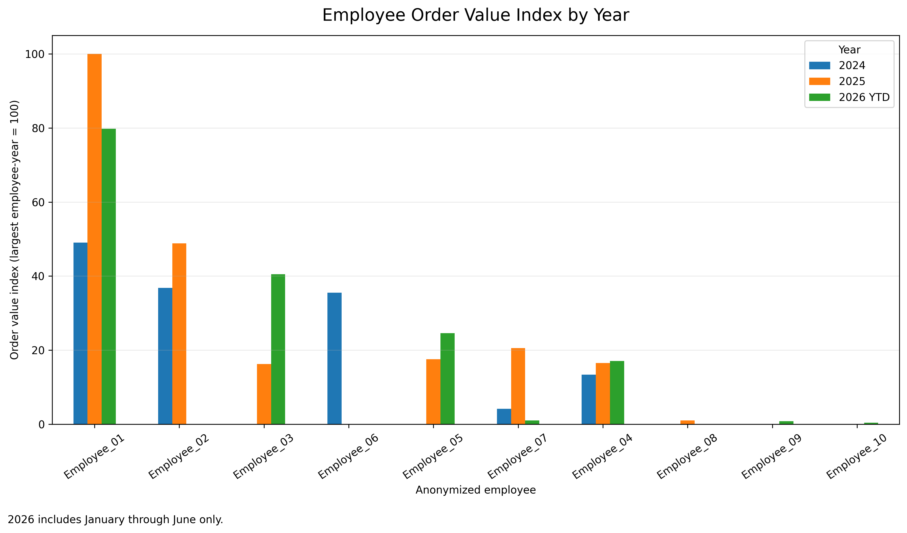
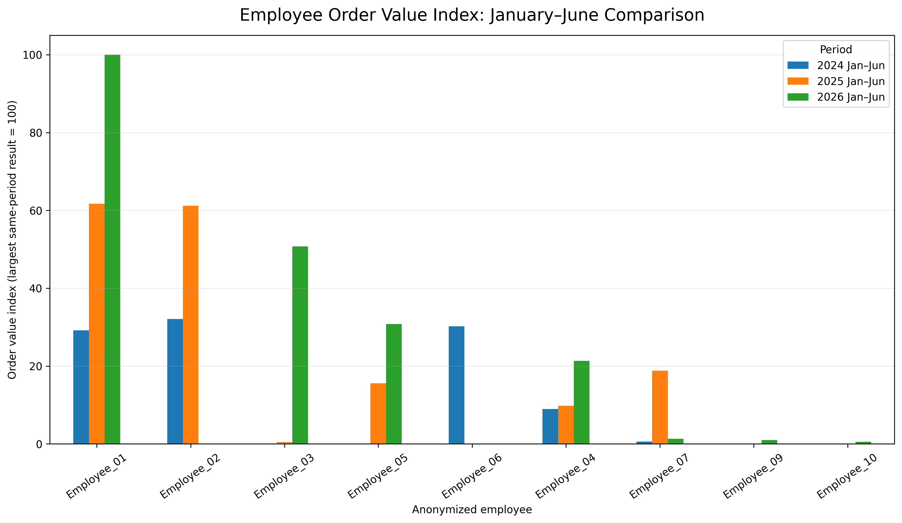
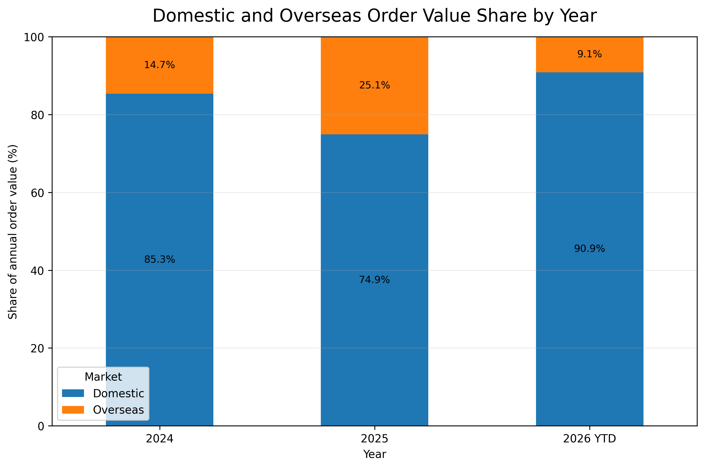

# Industrial Automation Sales Analysis

## Project Overview

This project analyzes anonymized ERP order data from an industrial automation company between January 2024 and June 2026.

The goal was to build a reproducible workflow that:

- cleans raw order records,
- distinguishes domestic and overseas orders,
- converts overseas order values into KRW,
- identifies the highest-value customers,
- compares employee performance across years,
- and presents the results through clear visualizations.

All company names, customer names, employee names, and monetary amounts were removed or transformed before publication.

---

## Business Questions

1. Which customers generated the highest order value?
2. How did the top customers' order activity change over time?
3. How much of each top customer's activity came from domestic or overseas orders?
4. How did employee order performance vary by year?
5. How did the domestic and overseas sales mix change from 2024 to 2026 YTD?

---

## Dataset

The private ERP source contained 2,511 historical rows.

After limiting the analysis to January 2024 through June 2026, keeping formal A/B orders, excluding T-type orders, and removing invalid records, the final private analytical dataset contained:

- 569 formal order records
- 468 domestic orders
- 101 overseas orders
- 88 standardized customers
- 10 employees

The public repository contains only anonymized and indexed summary data.

---

## Data Processing Rules

- Domestic orders: `Amt`
- Overseas orders: `Amt × Mny`
- `wAmt`: used as a validation reference
- Formal orders: A and B
- Excluded orders: T
- Employee field: `PostName`
- Historical departments were standardized before analysis
- Customer names were cleaned and standardized before ranking

Actual monetary values were replaced with relative index values.

For example:

- the largest customer total is indexed to `100`,
- other customers are shown relative to that value,
- and monthly values are indexed to the largest customer-month value.

---

## Key Findings

### 1. Customer concentration

The five highest-value customers had total value indices of:

| Rank | Customer | Order Value Index |
|---:|---|---:|
| 1 | Customer_01 | 100.0 |
| 2 | Customer_02 | 89.0 |
| 3 | Customer_03 | 79.6 |
| 4 | Customer_04 | 75.7 |
| 5 | Customer_05 | 73.6 |

This indicates that several major customers contributed at relatively similar levels rather than one customer dominating the entire ranking.

### 2. Domestic and overseas customer mix

- Customer_01, Customer_02, and Customer_04 were entirely domestic.
- Customer_03 was entirely overseas.
- Customer_05 was primarily overseas, with approximately 86.5% of its value from overseas orders.

### 3. Monthly order volatility

The monthly trend shows that major customers often generated value through a small number of large order months rather than through evenly distributed monthly activity.

### 4. Employee performance

Employee_01 recorded the highest indexed annual result in 2025 and the highest January-June indexed result in 2026.

Because 2026 contains only January through June, the project includes both:

- an annual/YTD comparison, and
- a fair January-June same-period comparison.

### 5. Domestic and overseas mix by year

Overseas share of total indexed order value:

- 2024: 14.7%
- 2025: 25.1%
- 2026 YTD: 9.1%

The overseas share increased in 2025 before declining in the first half of 2026.

---

## Visualizations

### Top 5 Customers by Order Value Index



### Domestic and Overseas Share of Top 5 Customers



### Monthly Order Value Index for Top 5 Customers



### Employee Order Value Index by Year



### Employee January-June Comparison



### Domestic and Overseas Order Value Share by Year



---

## Repository Structure

```text
industrial-automation-sales-analysis/
├── charts/
│   └── final/
├── data/
│   └── public/
├── notebooks/
│   └── 06_public_analysis.ipynb
├── report/
│   ├── final_report.md
│   └── public_findings.csv
├── .gitignore
└── README.md
```

---

## Tools Used

- Python
- pandas
- NumPy
- Matplotlib
- Google Colab
- Excel
- GitHub

---

## Privacy and Publication

The original ERP file and private cleaned data are not included in this repository.

The public files contain only anonymized customer IDs, anonymized employee IDs, index values, percentages, and aggregated results.

No raw company data should be uploaded to GitHub.

---

## Limitations

- 2026 data covers only January through June.
- Indexed values show relative performance, not actual currency amounts.
- Large individual orders can create sharp monthly spikes.
- The analysis measures order value, not profitability, margin, or realized revenue.
- Employee results reflect order attribution in the ERP system and should not be interpreted as a complete measure of individual performance.

---

## Author

JD Shin
