# Sales Performance Analysis for an Industrial Automation Company

## Background

An industrial automation company stores order records in its ERP system, including order dates, employees, customers, products, order amounts, and business divisions.

The initial business request was to visualize annual order performance by employee. I expanded the request into a broader data analysis project examining employee performance patterns, company-wide trends, customer concentration, monthly order distribution, and dependence on large orders.

To protect confidential company information, employee, customer, and business-division names were anonymized. Public visualizations use percentages and index values instead of actual financial amounts.

## Research Questions

1. How did company order performance change across years?

2. How did employees differ in total order value, order count, and average order value?

3. Were employee results spread across many orders or concentrated in a few large orders?

4. How concentrated was the company’s order value among major customers?

5. Did monthly order patterns show a consistent seasonal pattern?

6. How did the first half of 2026 compare with the same period in 2024 and 2025?

## Data

The original dataset contained 2,511 ERP order records covering January 2010 through June 2026.

The main variables used in the analysis were:

- Order date

- Order number

- Employee

- Customer

- Product

- Product specification

- Quantity

- Order amount

- Sales type

- Business division

- Expected delivery date

- Completed delivery date

- Record status

## Data Cleaning

The original ERP column names were renamed to clearer English names.

Dates stored in formats such as `20260520` were converted into standard date values. Order quantities and amounts were converted into numeric variables.

Records were included only when:

- `record_status` was 0

- `order_amount` was greater than 0

- `order_date` was valid

- `order_number` did not begin with `T`

After cleaning, 1,933 of the original 2,511 records remained.

No duplicated order numbers were found in the cleaned dataset.

The meanings of `record_status = 1` and order numbers beginning with `T` should be confirmed with the company before the results are used for formal performance evaluation.

## Methods

The analysis included:

- Annual company order value

- Annual company order count

- Annual average order value

- Employee order value by year

- Employee order count

- Employee average order value

- January–June same-period comparisons

- Employee share of company order value

- Dependence on the largest one and three orders

- Monthly order-value distribution

- Customer concentration

- Business-division comparison

For public charts, original financial values were converted into index values or percentage shares.

The company’s 2020 result was set equal to 100 for long-term index comparisons.

## Key Findings

### 1. Company performance declined sharply in 2024 and partially recovered in 2025

Using 2020 as the baseline of 100, the total order-value index was:

- 2020: 100.0

- 2021: 102.3

- 2022: 122.8

- 2023: 101.9

- 2024: 49.3

- 2025: 68.8

The highest indexed performance occurred in 2022. Order value declined sharply in 2024 and partially recovered in 2025.

### 2. The decline was influenced more by average order size than by order count

In 2024, the order-count index was 83.2, while the average-order-value index was 59.3.

This suggests that the decrease in total order value was not caused only by fewer orders. The decline in the average size of each order had a larger effect.

In 2025, the order-count index recovered to 92.3, while the average-order-value index recovered to 74.5.

### 3. The first half of 2026 outperformed the same period in 2025

The company’s order value from January through June 2026 was 16.6% higher than during the same period in 2025.

Because 2026 contains only six months of data, it was compared with the same January–June period in earlier years rather than with complete annual results.

### 4. Employees showed different sales-performance patterns

Some employees generated performance through many orders with moderate average values, while other employees handled fewer but much larger orders.

One anonymized employee accounted for 53.5% of company order value during the first half of 2026.

This shows that total order value alone does not fully explain employee performance. Order count, average order value, and dependence on large orders should also be considered.

### 5. Dependence on large orders varied substantially

For the employee with the most diversified performance, the largest three orders represented only 18.9% of total order value.

For several other employees, the largest three orders represented approximately 80% or more of their total order value.

This indicates that some employees generated stable results across many orders, while others depended heavily on a small number of large contracts.

### 6. Customer concentration remained significant

During the first half of 2026:

- The largest customer represented 29.4% of total order value.

- The top three customers represented 49.4%.

- The top five customers represented 65.1%.

- The top ten customers represented 86.7%.

The company therefore remained meaningfully dependent on a limited number of major customers.

### 7. The customer base became somewhat broader

The number of customers during the January–June period increased from:

- 32 customers in 2024

- 37 customers in 2025

- 44 customers in 2026

The top-three customer concentration decreased slightly from 52.3% in 2024 to 49.4% in 2026.

This suggests that the customer base became somewhat more diversified, although major customers still accounted for a large portion of order value.

### 8. No consistent monthly seasonal pattern was found

The month with the highest share of first-half order value differed each year:

- 2024: April

- 2025: June

- 2026: March

The data did not show a stable seasonal pattern across the three years.

A small number of large orders may have strongly affected the monthly results.

### 9. Business-division comparisons require caution

A comparison of 2025 and 2026 showed changes in the shares of current business divisions.

However, business-division names appear to have changed over time. Long-term division comparisons should not be made until the company confirms whether older and newer division names represent organizational restructuring or different departments.

## Visualizations

### Employee Share of Company Order Value

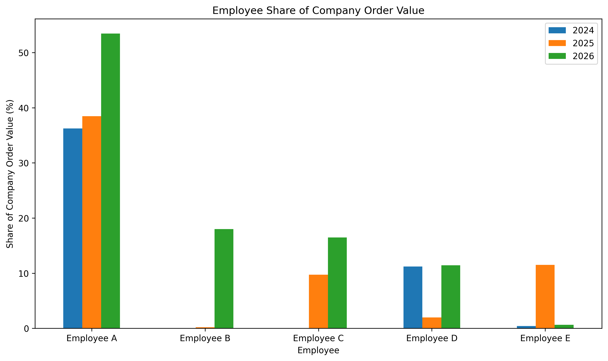

### Annual Company Order Value Index

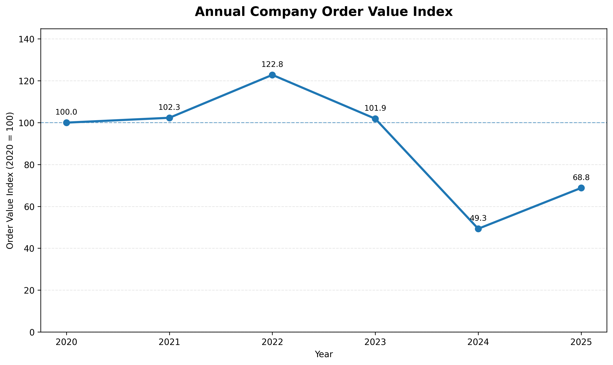

### Annual Company Order Count Index

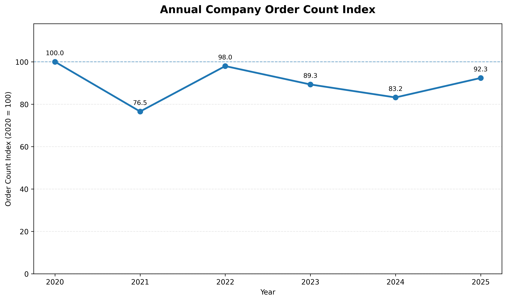

### Annual Average Order Value Index

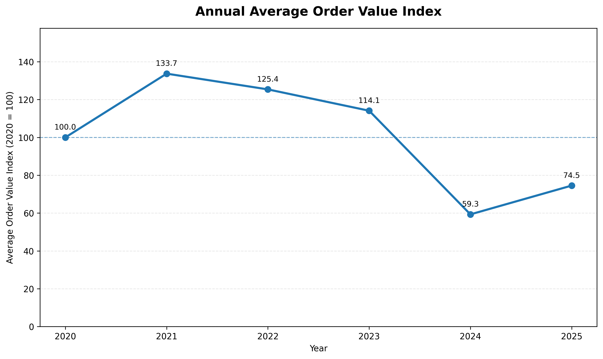

### Company Order Performance Indices

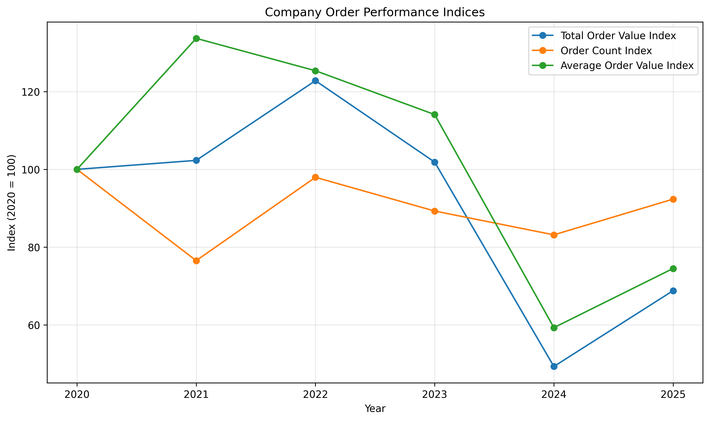

### Employee Order Frequency and Average Order Value

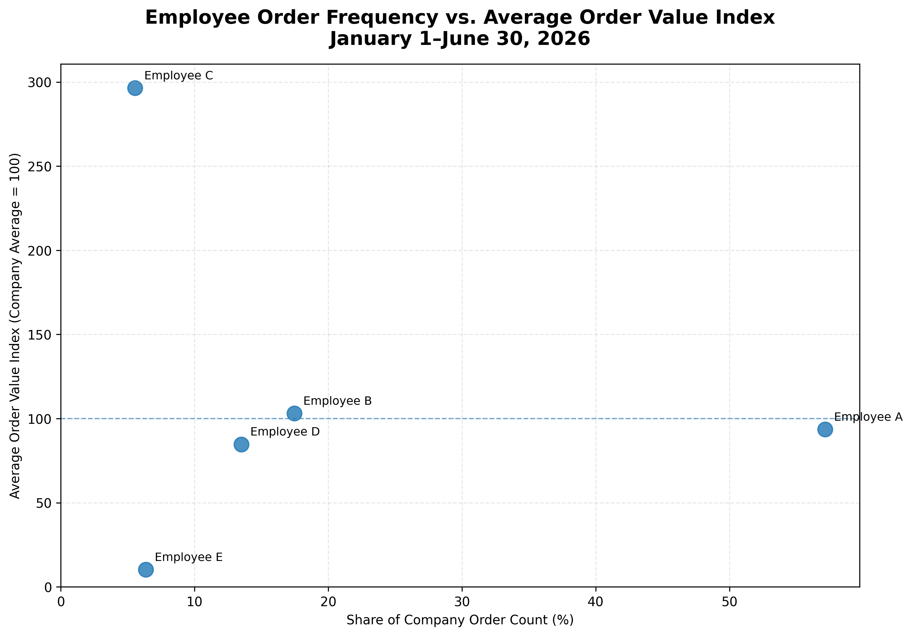

### Employee Dependence on Large Orders

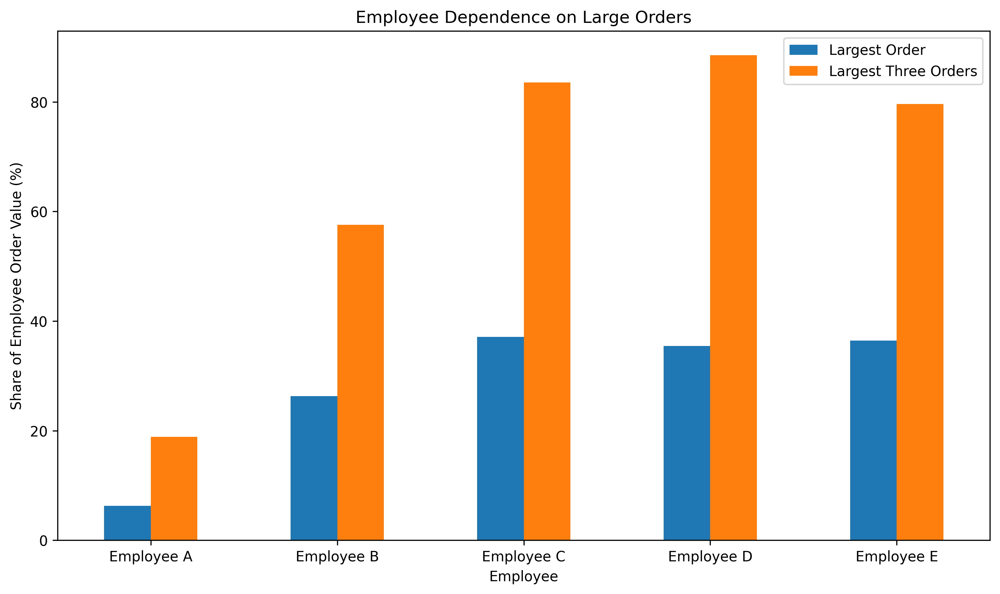

### Monthly Order-Value Distribution

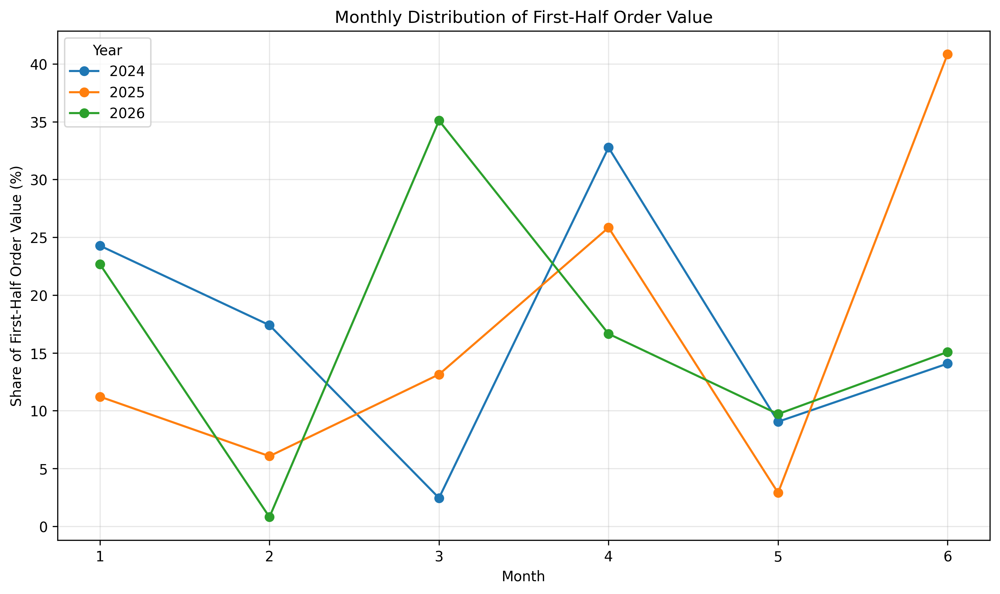

### Top Customer Order Share

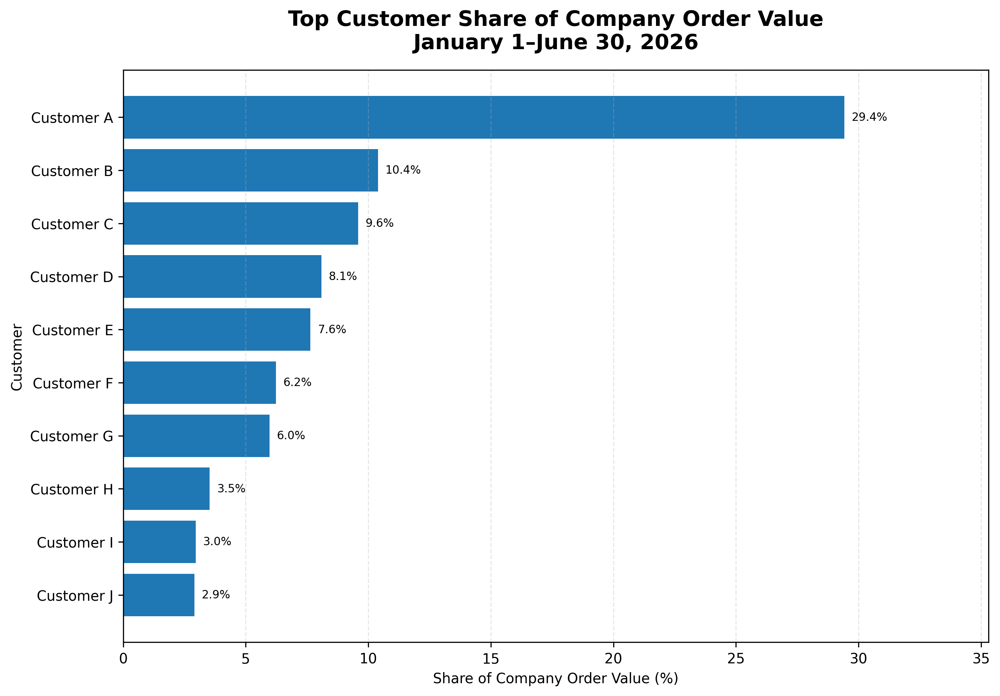

### Customer Concentration Trend

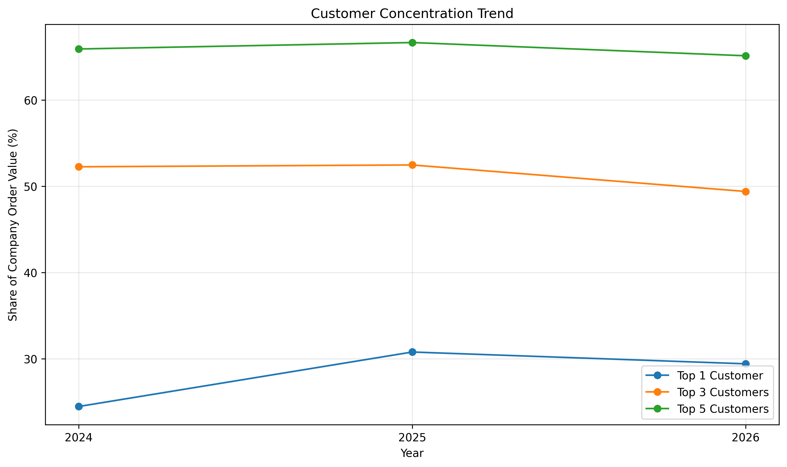

### Business-Division Order Share

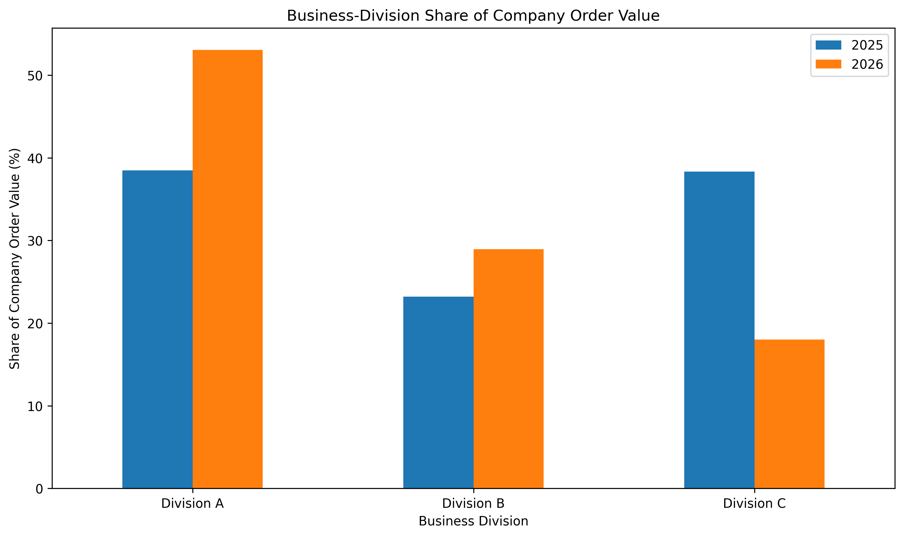

## Business Implications

The analysis suggests several ways the company could improve internal performance monitoring:

1. Evaluate employees using multiple measures instead of total order value alone.

2. Track order count and average order value separately.

3. Monitor employee dependence on a few large orders.

4. Monitor concentration among major customers.

5. Compare incomplete years only with the same period in previous years.

6. Record organizational changes so business-division performance can be compared consistently.

7. Combine order data with employee targets to calculate target-achievement rates.

8. Consider profitability data in addition to order value.

## Limitations

This analysis has several limitations:

- It uses order value rather than profit or profit margin.

- A high order value does not necessarily mean high profitability.

- Large individual orders can strongly affect monthly and annual results.

- Employee assignments may change during a project.

- Shared or collaborative sales efforts are not identified.

- Cancelled or modified orders may require additional company rules.

- Business-division names appear to have changed over time.

- 2026 data includes only January through June.

- The analysis identifies patterns, not causes.

## Privacy and Ethics

The original ERP data contains confidential company, employee, customer, product, and financial information.

The following materials will not be uploaded to a public repository:

- Original ERP data

- Employee names

- Customer names

- Product details

- Actual financial amounts

- Internal SQL files

- Internal Excel dashboards

Public materials use:

- Employee labels such as `Employee A`

- Customer labels such as `Customer A`

- Business-division labels such as `Division A`

- Percentage shares

- Indexed financial values

## Reflection

This project showed me that working with real business data requires more than creating graphs.

I had to understand unfamiliar ERP variables, define data-cleaning rules, compare partial-year data fairly, recognize misleading percentage changes, and protect confidential information.

I also learned that relying on a single performance measure can be misleading. Total order value, order count, average order size, dependence on large contracts, and customer concentration each reveal different parts of company performance.

The project strengthened my interest in data science because it required both technical analysis and careful interpretation of a real business problem.
